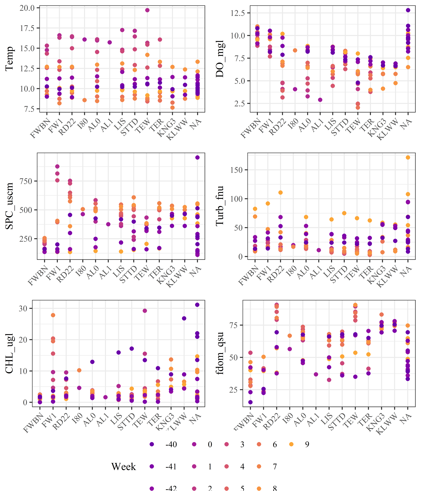
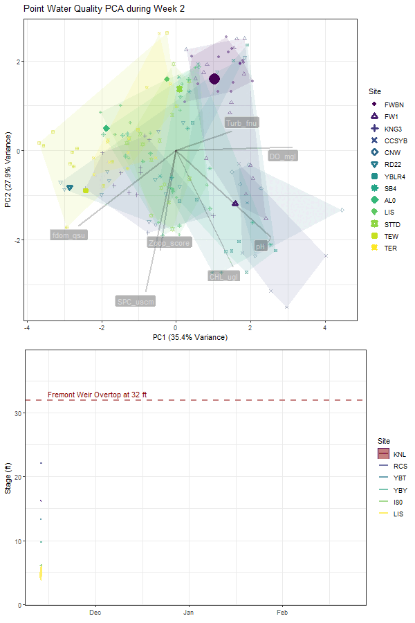

```{r setup, include=FALSE}
library(sf)
library(leaflet)
library(dplyr)
library(shiny)
library(flexdashboard)
library(readxl)
library(tidyverse)

# Load spatial objects from your saved Rdata file
load("../data/spatial/Yolo_map_data.Rdata")

# Load project points
proj_raw <- read_excel("../Data/tabular/YBLTE_sites.xlsx")

proj_pts <- proj_raw %>%
  st_as_sf(coords = c("Lon", "Lat"), crs = 4326, remove = FALSE)

# Prepare restoration polygons
yolo_bypass <- bypasses[bypasses$Feature_Name %in% 
                          c("Sacramento Bypass", "Yolo Bypass", "Yolo Bypass and Cache Slough"), ]

ywa <- ywa_poly[ywa_poly$PROP_NAME == "Yolo Bypass Wildlife Area",
                c("PROP_NAME", "PROP_TYPE")]

ywa$Project_Status <- "Completed"
colnames(ywa) <- c("project_name", "project_type", "geometry", "Project_Status")

polygons <- st_transform(polygons, st_crs(ywa))
rest_polys <- rbind(polygons[,c("project_name", "project_type","Project_Status")], ywa)

sf::sf_use_s2(FALSE)
rest_polys$acres <- round(as.numeric(st_area(rest_polys)) * 0.00024711, 1)

```
Interactive map
=====================================
```{r}
leaflet(rest_polys) %>%
  addProviderTiles("Esri.WorldImagery") %>%
  addPolygons(
    color = "blue", weight = 1, fillOpacity = 0.5,
    group = "Restoration Projects",
    popup = ~paste0(
      "<b>Name:</b> ", project_name, "<br>",
      "<b>Type:</b> ", project_type, "<br>",
      "<b>Status:</b> ", Project_Status, "<br>",
      "<b>Acreage:</b> ", acres
    )
  ) %>%
  addCircleMarkers(
    data = proj_pts,
    lng = ~Lon, lat = ~Lat,
    radius = 6, color = "red",
    fillColor = "yellow", fillOpacity = 0.8,
    popup = ~paste0("<b>Project:</b> ", Site_id)
  ) %>%
  addLayersControl(
    baseGroups = c("Imagery"),
    overlayGroups = c("Restoration Projects"),
    options = layersControlOptions(collapsed = FALSE)
  )
```
Heatmap
=====================================

Water‑Quality Heat Map
```{r}

```

PCA animation
=====================================

Water‑Quality PCA
```{r}

```