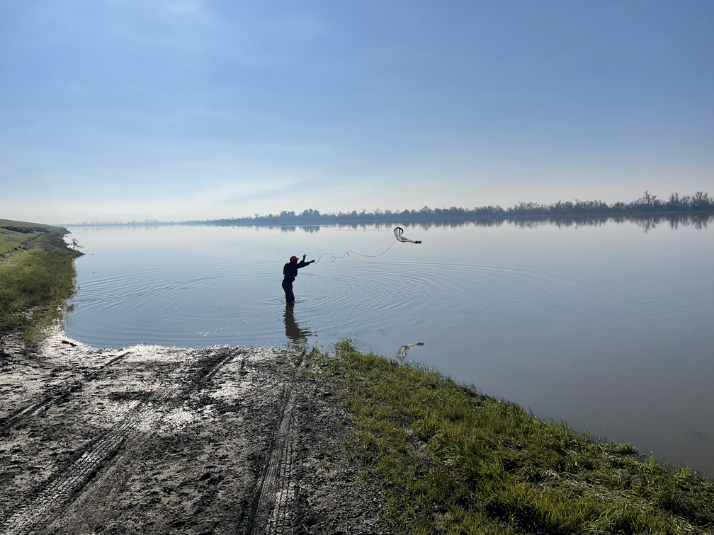
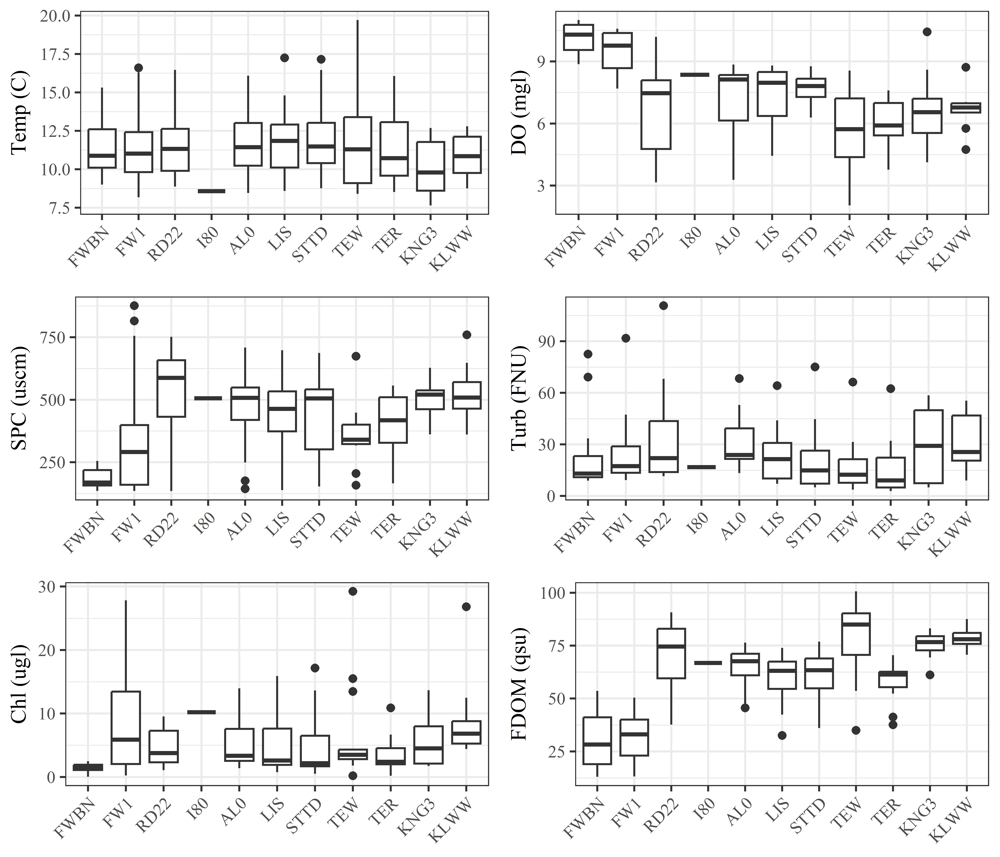
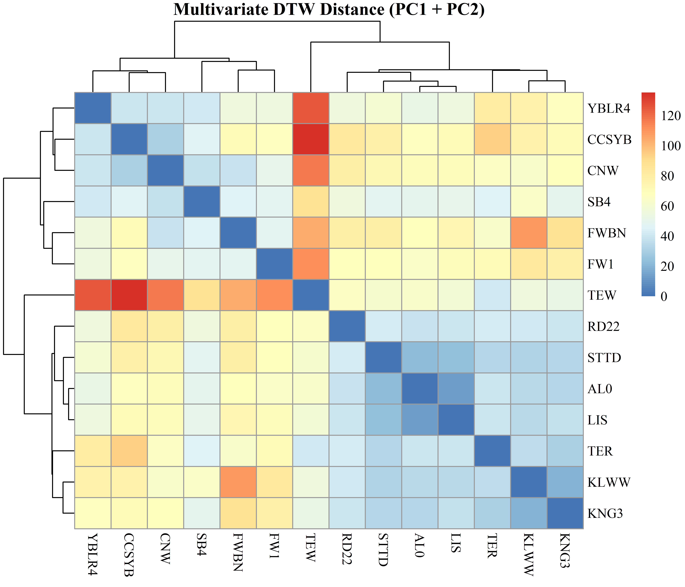

```{r setup, include=FALSE}
library(sf)
library(leaflet)
library(dplyr)
library(shiny)
library(flexdashboard)
library(readxl)
library(tidyverse)
library(dygraphs)
library(plotly)
library(scales)

# Set colors
animCol <- scale_color_manual(values = c("KNL" = "#440154FF",
                                          "KLG" = "#444444",
                                          "RCS" = "#482878FF",
                                          "FRE" = "#B63679FF",
                                          "YBT" = "#3E4A89FF",
                                          "CCY" = "#FB8861FF",
                                          "YBY" = "#31688EFF",
                                          "PTC" = "#CED483",
                                          "FWBN" = "#B63679FF", 
                                          "FW1" = "#440154FF", 
                                          "KLWW" = "#482878FF",
                                          "KNG3" = "#453581FF", 
                                          "CCSYB" = "#FB8861FF",
                                          "CNW" = "#34618DFF",
                                          "RD22" = "#2B748EFF", 
                                          "YBLR4" = "#24878EFF", 
                                          "SB4" = "#1F998AFF",
                                          "I80" = "#25AC82FF", 
                                          "AL0" = "#40BC72FF",
                                          "LIS" = "#67CC5CFF", 
                                          "STTD" = "#73A32F", 
                                          "TEW" = "#ADE11E",
                                          "TER" = "#FDE725FF"))
animFill <- scale_fill_manual(values = c("KNL" = "#440154FF",
                                          "RCS" = "#482878FF",
                                          "FRE" = "#B63679FF",
                                          "YBT" = "#3E4A89FF",
                                          "CCY" = "#FB8861FF",
                                          "YBY" = "#31688EFF",
                                          "PTC" = "#E0E092",
                                          "FWBN" = "#B63679FF", 
                                          "FW1" = "#440154FF", 
                                          "KLWW" = "#482878FF",
                                          "KNG3" = "#453581FF", 
                                          "CCSYB" = "#FB8861FF",
                                          "CNW" = "#34618DFF",
                                          "RD22" = "#2B748EFF", 
                                          "YBLR4" = "#24878EFF", 
                                          "SB4" = "#1F998AFF",
                                          "I80" = "#25AC82FF", 
                                          "AL0" = "#40BC72FF",
                                          "LIS" = "#67CC5CFF", 
                                          "STTD" = "#73A32F", 
                                          "TEW" = "#ADE11E",
                                          "TER" = "#FDE725FF"))
plotly_col <- c("#B63679FF",  "#440154FF",  "#482878FF", "#453581FF",  "#FB8861FF",
              "#34618DFF", "#2B748EFF",  "#24878EFF", "#1F998AFF", "#40BC72FF",
              "#67CC5CFF",  "#73A32F", "#ADE11E", "#FDE725FF")
plotly_col <- setNames(plotly_col, c("FWBN", "FW1", "KLWW","KNG3", "CCSYB",
              "CNW","RD22", "YBLR4", "SB4", "AL0",
              "LIS", "STTD", "TEW", "TER"))

# Load spatial objects from your saved Rdata file
load("../Data/spatial/Yolo_map_data.Rdata")

# Load project points
proj_raw <- read_excel("../Data/tabular/YBLTE_sites.xlsx")

proj_pts <- proj_raw %>%
  st_as_sf(coords = c("Lon", "Lat"), crs = 4326, remove = FALSE)

# Filter points for sites of interest
proj_pts <- proj_pts %>% filter((Sampletype == "main")|(Sampletype == "fish only"))

# Prepare restoration polygons
yolo_bypass <- bypasses[bypasses$Feature_Name %in% 
                          c("Sacramento Bypass", "Yolo Bypass", "Yolo Bypass and Cache Slough"), ]

ywa <- ywa_poly[ywa_poly$PROP_NAME == "Yolo Bypass Wildlife Area",
                c("PROP_NAME", "PROP_TYPE")]

ywa$Project_Status <- "Completed"
colnames(ywa) <- c("project_name", "project_type", "geometry", "Project_Status")

polygons <- st_transform(polygons, st_crs(ywa))
rest_polys <- rbind(polygons[,c("project_name", "project_type","Project_Status")], ywa)

sf::sf_use_s2(FALSE)
rest_polys$acres <- round(as.numeric(st_area(rest_polys)) * 0.00024711, 1)

# Get logger data
load("../Data/YBLTE_logger.RData")
startdate <- as.POSIXct("2025-11-01")
enddate <- enddate <- as.POSIXct("2026-05-31")

```

Overview {data-orientation=rows}
=====================================
Row {data-height='33%'}
-------------------------------------
###
Hello!

The Yolo Bypass Lower Trophic Enhancement (YBLTE) builds on current lower trophic (LT) sampling in the bypass. LT includes phytoplankton and zooplankton that provide food for fish.

We sampled water quality, chlorophyll, zooplankton, and fish across Yolo to better understand how hydrology, environmental conditions, LT, and fish habitat suitability are connected.

Dominating water sources: Sacramento River, Colusa Basin (Ridgecut), Cache Creek, Putah Creek (not as influential this year)

Explore our dashboard to see what we found!

Feel free to direct any questions and/or feedback to Eric.Holmes@water.ca.gov or Kristina.Nguyen@water.ca.gov.

Row {data-height='67%'}
-------------------------------------
### science in action!
```{r}

```

Interactive map
=====================================
Col {data-width='25%'}
-------------------------------------
### 
The map shows the sites where we sampled. 

Click on each for more information! You can also zoom in/out and select which layers to show.

Col {data-width='75%'}
-------------------------------------
### 
```{r}
leaflet(rest_polys) %>%
  addProviderTiles("Esri.WorldImagery") %>%
  addPolygons(
    color = "blue", weight = 1, fillOpacity = 0.5,
    group = "Restoration Projects",
    popup = ~paste0(
      "<b>Name:</b> ", project_name, "<br>",
      "<b>Type:</b> ", project_type, "<br>",
      "<b>Status:</b> ", Project_Status, "<br>",
      "<b>Acreage:</b> ", acres
    )
  ) %>%
  addCircleMarkers(
    data = proj_pts %>% filter(Site_id=="FWBN"),
    lng = ~Lon, lat = ~Lat,
    radius = 10, color = "#B63679FF",
    group = "Water Source Site",
    fillOpacity = 0.8,
    popup = ~paste0("<b>Tributary:</b> Sacramento River") 
    ) %>%
  addCircleMarkers(
    data = proj_pts %>% filter(Site_id=="KLWW"),
    lng = ~Lon, lat = ~Lat,
    radius = 10, color = "#482878FF",
    group = "Water Source Site",
    fillOpacity = 0.8,
    popup = ~paste0("<b>Tributary:</b> Colusa Basin") 
    ) %>%
  addCircleMarkers(
    data = proj_pts %>% filter(Site_id=="CCSYB"),
    lng = ~Lon, lat = ~Lat,
    radius = 10, color = "#FB8861FF",
    group = "Water Source Site",
    fillOpacity = 0.8,
    popup = ~paste0("<b>Tributary:</b> Cache Creek") 
    ) %>%
  addCircleMarkers(
    data = proj_pts,
    lng = ~Lon, lat = ~Lat,
    radius = 6, color = ~ifelse(proj_pts$Sampletype=="main", "red", "steelblue"),
    group = ~ifelse(proj_pts$Sampletype=="main", "Main Site", "Fish Only Site"),
    fillColor = "yellow", fillOpacity = 0.8,
    popup = ~paste0("<b>Project:</b> ", Site_id, " (", Sitename, ")<br>", Sitetype, " Site<br>Data: ",
                    ifelse(Point_wq=="n", "", "Point Water Quality - "),
                    ifelse(Point_wq=="p", "(partial) - ", ""),
                    ifelse(Zoop=="n", "", "Zooplankton - "),
                    ifelse(Zoop=="p", "(partial) - ", ""),
                    ifelse(Fish=="n", "", "Fish - "),
                    ifelse(Fish=="p", "(partial) - ", ""),
                    ifelse(DOBO=="n", "", "DOBO - "),
                    ifelse(DOBO=="p", "(partial) - ", "")) 
    )%>%
  addLayersControl(
    overlayGroups = c("Water Source Site", "Main Site", "Fish Only Site", "Restoration Projects"),
    options = layersControlOptions(collapsed = FALSE)
  ) %>% 
  setView(lat = 38.45, lng = -121.6, zoom = 9)
```
Heatmaps
=====================================
Col {data-width='25%'}
-------------------------------------
### 
The heat maps depict point water quality measurements across sites over time.

- Large cladocera: key zooplankton for juvenile salmon feeding.
  - A density of 1 per L has been shown to allow for maximum growth of juvenile chinook.

- SPC: specific conductivity

- Chl: chlorophyll-a

- DO: dissolved oxygen

- Turb: turbidity

- FDOM: fluorescent dissolved organic matter


What do you notice?

- Site differences

- Changes across (or in a few) sites at certain points

- Correlating variables

- Comparisons to tributaries (FWBN, KLWW, CCSYB)

Col {data-width='75%'}
-------------------------------------
### 
```{r}

```

Logger Data
=====================================
Col {data-width='25%'}
-------------------------------------
### 
These are continuous time series of temperature, dissolved oxygen, and specific conductivity from our loggers.

Select which sites to display by messing with the legend!

Notice how sites follow each other closely or highly vary at times.

Col {data-width='75%'}
-------------------------------------
### 
```{r}
make_all_station_plots <- function() {
  
  stations <- sort(unique(dobodat$station))
  
  # Temperature panel
  p_temp <- plot_ly(type = "scatter", mode = "lines")
  for (s in stations) {
    df <- dobodat %>% filter(station == s)
    df_sb4 <- dobo_sb4 %>% filter(station == s)
    p_temp <- p_temp %>%
      add_trace(
        data = df,
        x = ~datetime, y = ~temp_c,
        name = s,
        legendgroup = s,
        opacity = 0.7,
        showlegend = TRUE,                 # only here
        line = list(color = plotly_col[s])
      ) %>% 
      add_trace(
        data = df_sb4,
        x = ~datetime, y = ~temp_c,
        name = s,
        legendgroup = s,
        opacity = 0.7,
        showlegend = FALSE,                # hide duplicate legend entries                
        line = list(color = plotly_col[s])
      )
  }
  p_temp <- p_temp %>% layout(yaxis = list(title = "Temp (°C)"))
  
  # DO panel
  p_do <- plot_ly(type = "scatter", mode = "lines")
  for (s in stations) {
    df <- dobodat %>% filter(station == s)
    df_sb4 <- dobo_sb4 %>% filter(station == s)
    p_do <- p_do %>%
      add_trace(
        data = df,
        x = ~datetime, y = ~do_mgl,
        name = s,
        legendgroup = s,
        opacity = 0.7,
        showlegend = FALSE,                # hide duplicate legend entries
        line = list(color = plotly_col[s])
      ) %>% 
      add_trace(
        data = df_sb4,
        x = ~datetime, y = ~do_mgl,
        name = s,
        legendgroup = s,
        opacity = 0.7,
        showlegend = FALSE,                 
        line = list(color = plotly_col[s])
      )
  }
  p_do <- p_do %>% layout(yaxis = list(title = "DO (mg/L)"))
  
  # SPC panel
  p_spc <- plot_ly(type = "scatter", mode = "lines")
  for (s in stations) {
    df <- conddat %>% filter(station == s)
    df_sb4 <- cond_sb4 %>% filter(station == s)
    p_spc <- p_spc %>%
      add_trace(
        data = df,
        x = ~datetime, y = ~spc,
        name = s,
        legendgroup = s,
        opacity = 0.7,
        showlegend = FALSE,                # hide duplicate legend entries
        line = list(color = plotly_col[s])
      ) %>%
      add_trace(
        data = df_sb4,
        x = ~datetime, y = ~spc,
        name = s,
        legendgroup = s,
        opacity = 0.7,
        showlegend = FALSE,                # hide duplicate legend entries
        line = list(color = plotly_col[s])
      )
    
  }
  p_spc <- p_spc %>% layout(yaxis = list(title = "SPC (µS/cm)"))
  
  # Stack vertically with shared x-axis
  subplot(p_temp, p_do, p_spc,
          nrows = 3,
          shareX = TRUE,
          titleY = TRUE) %>%
  layout(xaxis = list(title = NA, range = c(startdate, enddate)))
}


make_all_station_plots()

```

PCA animation {data-orientation=rows}
=====================================
Col {data-height='80%'}
-------------------------------------
### 
```{r}
knitr::include_graphics("../Output/Figures/pca_flow_horizontal2.gif")
```

Col {data-height='20%'}
-------------------------------------
### 
PCA (principal component analysis) simplifies multiple variables into components. Here, we took 6 water quality parameters into two components (there are more these explain most of the variance and are easy to visualize).

To interpret, each parameter has a vector showing its axis. For example, points going toward the SPC vector have higher SPC. We can thus reference the actual parameter value of each point while being able to compare them to each other on this 2D space. Essentially, points closer together are more similar.

We have general areas of the main tributaries mapped out to see how points move between them across time. STTD in particular is highlighted as it's a downstream site and very influenced by how each tributary is flowing.On the right are plots showing tributary flow to compare with how sites respond accordingly.

3D PCA Cylinders
=====================================
Col {data-width='25%'}
-------------------------------------
### (See more PCA info at the PCA animation tab!)
In addition to the two principle components, an axis for time shows how sites change throughout the season. Time is going from down to up! As a still figure, you can compare how sites vary and move across tributaries at the same time.

You can drag the screen to change the perspective and select which sites/paths (points/lines) are visible from the legend.

Col {data-width='75%'}
-------------------------------------
### 
```{r}
# PCA for point wq ----
wqp <- readxl::read_excel("../Data/tabular/YBLTE_point_wq.xlsx")

wqp <- filter(wqp, Sample_Type=="zoop")

# for plotting, not listed sites were dropped (sitefac is NA)
wqp$Sitefac <- factor(wqp$Site, levels = c("FWBN", "FW1", 
                                           "KLWW","KNG3", "CCSYB",
                                           "CNW","RD22", 
                                           "YBLR4", "SB4", #"I80", 
                                           "AL0","LIS", "STTD", "TEW","TER"))


wqp$week <- as.integer(format(wqp$Date, format = "%W"))
wqp$week <- ifelse(wqp$week>=43, wqp$week-43, wqp$week+9)
wqp$weekchr <- as.character(wqp$week)
wqp$fdom_qsu <- as.numeric(wqp$fdom_qsu)

wqp$Zoop_score <- as.numeric(wqp$Zoop_score)
# filter var of interest; temp too variable (discrete data),
  # sal and TDS like SPC, pc like chlorop, zoop not significant and not at every site
pc_in <- data.frame(wqp[wqp$Date > as.Date("2025-11-15")& wqp$Date < as.Date("2026-04-01"),
                        c("RowID","Site","Sitefac", "Date", "DO_mgl", "SPC_uscm", "pH",           
                          "Turb_fnu", "CHL_ugl", "fdom_qsu", "week")])
rownames(pc_in) <- paste(pc_in$Site, pc_in$RowID)
pc_in <- drop_na(pc_in)
pc_in <- pc_in[pc_in$RowID != 257,] ## dropping KLWW on day when flow was reversing

# PCA calculation
pc <- prcomp(subset(pc_in, select=-c(RowID, Site,Sitefac, Date, week)), scale=T)
pc$rotation <- -1*pc$rotation
pc$x <- -1*pc$x

# get variance per PC
pc_var <- pc$sdev^2 / sum(pc$sdev^2) # PC 1-4 explain most variance (36%, 28, 14, 9)
pc1_v <- round(pc_var[1] * 100, 1)
pc2_v <- round(pc_var[2] * 100, 1)

# create new df for plotting scores
pc_score <- as.data.frame(pc$x[, 1:2])
pc_score$Sitefac <- pc_in$Sitefac
pc_score$Date <- pc_in$Date
pc_score$week <- pc_in$week

# df for plotting each var within the PC
pc_load <- as.data.frame(pc$rotation[, 1:2])
scaling_factor <- 1.2 * max(abs(pc_score[, 1:2]))
pc_load_scaled <- pc_load*scaling_factor

pc_score$weekDate <- floor_date(pc_score$Date, "week")
pc_score <- pc_score[order(pc_score$Sitefac, pc_score$week),]
pc_score$pc1_next <- c(pc_score$PC1[-1], NA)
pc_score$pc2_next <- c(pc_score$PC2[-1], NA)

tribs <- c("CCSYB", "KLWW", "FWBN")

trib_cols <- c("#B63679FF","#482878FF", "#FB8861FF")

trib_stats <- pc_score %>%
  filter(Sitefac %in% tribs) %>%
  group_by(Sitefac) %>%
  group_modify(~{
    pts <- st_as_sf(.x, coords = c("PC1","PC2"), crs = NA)
    hull <- st_convex_hull(st_combine(pts))
    tibble(
      geometry = hull,
      area = as.numeric(st_area(hull)),
      radius = sqrt(as.numeric(st_area(hull)) / pi),
      cx = st_coordinates(st_centroid(hull))[1],
      cy = st_coordinates(st_centroid(hull))[2]
    )
  })

make_cylinder <- function(cx, cy, r, zmin, zmax, n = 60) {
  theta <- seq(0, 2*pi, length.out = n)
  x_bottom <- cx + r * cos(theta)
  y_bottom <- cy + r * sin(theta)
  z_bottom <- rep(zmin, n)
  x_top <- cx + r * cos(theta)
  y_top <- cy + r * sin(theta)
  z_top <- rep(zmax, n)
  x <- c(x_bottom, x_top)
  y <- c(y_bottom, y_top)
  z <- c(z_bottom, z_top)
  i <- c(); j <- c(); k <- c()
  for (t in 1:(n-1)) {
    i <- c(i, t, t+1)
    j <- c(j, t+1, t+1+n)
    k <- c(k, t+n, t+n)
  }
  i <- c(i, n, 1, n)
  j <- c(j, 1, 1+n, 1+n)
  k <- c(k, n+n, n+1, n+n)
  list(x = x, y = y, z = z, i = i-1, j = j-1, k = k-1)
}

p <- plot_ly() %>%
  add_trace(
    data = pc_score,
    x = ~PC1, y = ~PC2, z = ~week,
    color = ~Sitefac,
    colors = plotly_col,
    type = "scatter3d",
    mode = "markers",
    marker = list(size = 3),
    opacity = 0.7
  ) %>%
  layout(
    scene = list(
      xaxis = list(title = "PC1"),
      yaxis = list(title = "PC2"),
      zaxis = list(title = "Week"),
      aspectmode = "manual",
      aspectratio = list(x = 2, y = 2, z = 0.7)
    )
  )


for(i in 1:nrow(trib_stats)) {
  t <- trib_stats[i, ]
  trib_col <- trib_cols[i]
  cyl <- make_cylinder(
    cx = t$cx,
    cy = t$cy,
    r  = t$radius,
    zmin = min(pc_score$week),
    zmax = max(pc_score$week)
  )
  p <- p %>%
    add_trace(
      x = cyl$x,
      y = cyl$y,
      z = cyl$z,
      i = cyl$i,
      j = cyl$j,
      k = cyl$k,
      type = "mesh3d",
      opacity = 0.15,
      facecolor = rep(trib_col, length(cyl$i)),
      name = paste(t$Sitefac, "region")
    )
}

for(s in unique(pc_score$Sitefac)) {
  df <- pc_score %>% filter(Sitefac == s) %>% arrange(week)
  p <- p %>%
    add_trace(
      data = df,
      x = ~PC1,
      y = ~PC2,
      z = ~week,
      color = ~Sitefac,
      colors = plotly_col,
      type = "scatter3d",
      mode = "lines",
      line = list(width = 4),
      opacity = 0.5,
      name = paste(s, "trajectory"),
      showlegend = TRUE
    )
}

p <- p %>% layout(
  legend = list(y = 1, itemsizing = "constant")
)

p

```

Dynamic Time Warping Analysis
=====================================
Col {data-width='25%'}
-------------------------------------
### 
Dynamic time warping (DTW) takes data in different time frames and transforms them to the same frame by where they are similar. DTW allows us to compare each site across the entire season.

The matrix directly compares each site by distance/difference (lower=similar). Based on distances, sites form 3 clusters that you can see from the tree on the top/left sides or color gradients. Why did they cluster?

1. YBLR4, CCSYB, CNW, SB4, FWBN, FW1
2. TEW
3. RD22, STTD, AL0, LIS, TER, KLWW, KNG3

Col {data-width='75%'}
-------------------------------------
### 
```{r}

```

End member mixing analysis
=====================================
Col {data-width='25%'}
-------------------------------------
### 
End member mixing analysis (EMMA) calculates the proportion of each water source per site. Our calculations were based on SPC and FDOM. You can compare EMMA with flow directly here to see discrepancy between sites.

Col {data-width='75%'}
-------------------------------------
### 
```{r}
knitr::include_graphics("../Output/Figures/YBLTE_EMMA_01.png")
```

Zooplankton barplots {data-orientation=rows}
=====================================
Col {data-height='90%'}
-------------------------------------
### 
```{r, fig.width=14, fig.height=6}
knitr::include_graphics("../Output/Figures/Zoop_weekly01.png")
# load(file = "../Data/YBLTE_Zoop_barplot_data.Rdata")
# 
# pastel_bold_pal <- c(
#   "Calanoida"        = "#4F82C8",  # bold pastel blue
#   "Cyclopoida"       = "#7FB3F0",  # lighter blue
#   "Small cladocera"  = "#7ECF82",  # light green
#   "Large cladocera"  = "#4FAF50",  # deeper green (same hue family)
#   "Small cladocera"  = "#8BCC8C",  # light green
#   "Rotifera"         = "#B38FD3",  # medium pastel-purple
#   "Ostracoda"        = "#E5C58B",  # sand / buff
#   "Insecta"          = "#F4A261",  # warm pastel orange
#   "Rare"             = "grey80"
# )
# 
# # -----------------------------
# # Weekly abundance barplot
# # -----------------------------
# weekly_bar_by_site_wrap <- ggplot(
#   zoop_weekly_group,
#   aes(x = week_start, y = totezoop, fill = group)
# ) +
#   geom_bar(stat = "identity", width = 7) +
#   facet_wrap(~ Sitefac, nrow = 3, scales = "free_y") +
#   theme_bw() +
#   scale_x_date(date_breaks = "1 month", date_labels = "%b-%1") +
#   scale_y_continuous(labels = label_number(scale_cut = cut_short_scale())) +
#   scale_fill_manual(values = pastel_bold_pal) +
#   labs(
#     x = NULL,
#     y = "Zooplankton Density (m^-3)",
#     fill = "Group"
#   ) +
#   theme(
#     axis.text.x = element_text(angle = 45, hjust = 1),
#     legend.position = "bottom"
#   )
# 
# 
# # -----------------------------
# # Percent-of-total barplot
# # -----------------------------
# pct_by_site <- ggplot(
#   zoop_weekly_pct,
#   aes(x = week_start, y = pct, fill = group)
# ) +
#   geom_bar(stat = "identity", width = 7) +
#   facet_wrap(~ Sitefac, nrow = 3) +
#   scale_fill_manual(values = pastel_bold_pal) +
#   scale_y_continuous(labels = scales::percent_format(accuracy = 1)) +
#   scale_x_date(date_breaks = "1 month", date_labels = "%b-%1") +
#   theme_bw() +
#   labs(
#     x = NULL,
#     y = "Percent of Total Community",
#     fill = "Group"
#   ) +
#   theme(
#     legend.position = "bottom",
#     axis.text.x = element_text(angle = 45, hjust = 1)
#   )
# 
# 
# # -----------------------------
# # Shared legend extraction
# # -----------------------------
# legend <- cowplot::get_legend(
#   weekly_bar_by_site_wrap +
#     theme(legend.position = "bottom")
# )
# 
# 
# # Remove legends from each plot
# p1 <- weekly_bar_by_site_wrap + theme(legend.position = "none")
# p2 <- pct_by_site + theme(legend.position = "none")
# 
# 
# # -----------------------------
# # Horizontal layout using cowplot
# # -----------------------------
# final_plot <- cowplot::plot_grid(
#   p1, p2,
#   labels = c("A", "B"),
#   nrow = 1,                    # <-- HORIZONTAL orientation
#   rel_widths = c(1, 1.05),     # adjust if one needs more width
#   align = "h"
# )
# 
# # Combine with shared legend
# final_plot_with_legend <- cowplot::plot_grid(
#   final_plot,
#   legend,
#   ncol = 1,
#   rel_heights = c(1, 0.12)
# )
# 
# final_plot_with_legend


```

Col {data-height='10%'}
-------------------------------------
### 
Zooplankton communities are important to consider in assessing the state of an ecosystem alongside suitability for fish. A large, balamced diversity builds community resilience. Additionally, each taxa provides different roles (food web interactions, nutrient cycling) and nutrition (fats. protein, nutrients). Of particular interest to juvenile chinook salmon are large cladocera, with highly energetic fats and are in the snackable size class.
